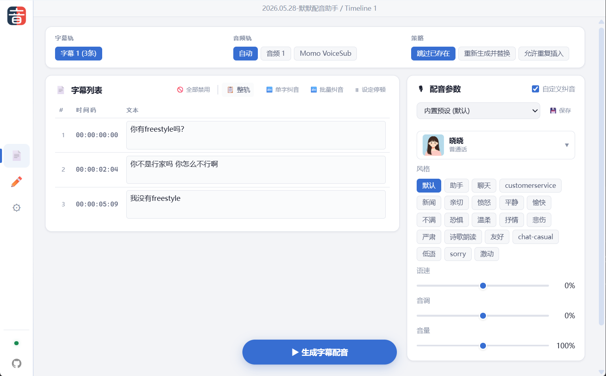

# 默默配音助手

默默配音助手是一个面向剪辑软件的配音插件项目，用于把字幕或手动输入的文字转换为机器人配音，并插入到当前时间线。

当前可用版本是 DaVinci Resolve Studio Workflow Integration 插件。Premiere Pro UXP 版本正在适配中。TTS 使用 Azure Speech REST API，用户需要在插件设置里填写自己的 Azure Speech Key 和区域或 Endpoint。



## 项目结构

```text
apps/
  com.momo.voicesub.dr/      # DaVinci Resolve Workflow Integration 插件
  com.momo.voicesub.pr/      # 2026.07.21初步开发完成，等待功能完善
scripts/
  dr-install.ps1                # 安装 DaVinci Resolve 版插件
  pr-install.ps1                # 安装 Premiere Pro 版插件（目前好像仅仅用于开发）
```

## 功能

- 读取当前时间线的字幕轨，批量生成配音。
- 将音频按字幕起始帧插入目标音频轨。
- 支持手动输入文字，并插入到当前播放头位置。
- 支持 Azure 音色、风格、语速、音调设置。
- 支持重复文字复用缓存，减少重复调用 Azure。
- 支持删除未使用缓存、删除当前项目缓存、删除所有项目缓存。
- 支持运行日志、复制日志、导出日志、打开开发者工具。

## DaVinci Resolve 安装

1. 安装 DaVinci Resolve Studio，并确保本机存在官方 Workflow Integration 示例文件：

   ```powershell
   C:\ProgramData\Blackmagic Design\DaVinci Resolve\Support\Developer\Workflow integrations\Examples\SamplePlugin\WorkflowIntegration.node
   ```

2. 在项目根目录运行安装脚本：

   ```powershell
   powershell -ExecutionPolicy Bypass -File .\scripts\dr-install.ps1
   ```

3. 重启 DaVinci Resolve Studio。

4. 在 Resolve 中打开：

   ```text
   工作区 > 流程整合 > 默默配音助手
   ```

安装脚本会把插件复制到：

```text
C:\ProgramData\Blackmagic Design\DaVinci Resolve\Support\Workflow Integration Plugins\com.momo.voicesub.dr
```

安装脚本还会从当前 Resolve 的官方示例目录复制 `WorkflowIntegration.node`。

## 使用

第一次使用时，打开"设置"页：

- 填写 Azure 区域，例如 `eastasia`。
- 或填写 Azure Endpoint，例如 `https://eastasia.api.cognitive.microsoft.com/`。
- 填写 Azure Speech Key。
- 点击"测试连接"确认可用。
- 点击"刷新音色"获取可选音色。
- 点击"保存设置"。

"字幕自动配音"页用于批量处理时间线字幕。

"手动配音"页用于输入一段文字，并把生成的音频插入当前播放头位置。

## Premiere Pro 开发版

开发版使用 UXP 开发，目前仅用于开发测试。

## 缓存

音频缓存默认保存在：

```text
%APPDATA%\momovoicesub\cache
```

同一段文字在相同音色、风格、语速、音调下会复用缓存文件，避免重复调用 Azure。

缓存清理在"设置"页中：

- 删除未使用的缓存：只删除当前项目中未被任何时间线使用的缓存。
- 删除当前项目所有缓存：删除当前项目的全部插件缓存。
- 删除所有项目缓存：删除默默配音助手的全部本机缓存。

## 许可证

本项目源代码基于 [GPL-3.0](LICENSE) 协议开源。

`WorkflowIntegration.node` 和 Azure Speech Service 不受此协议约束。
