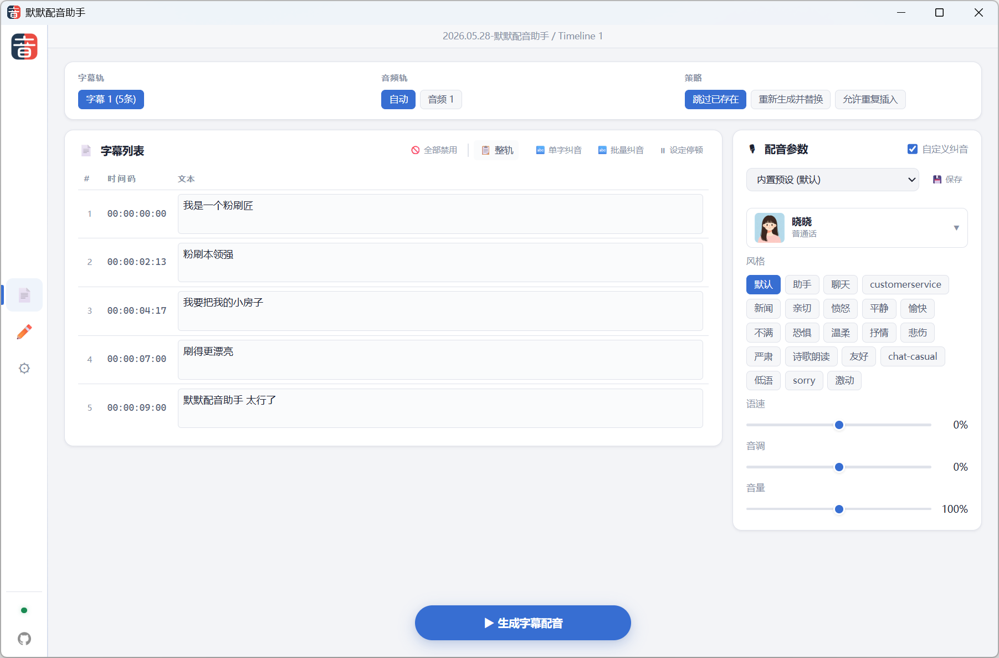
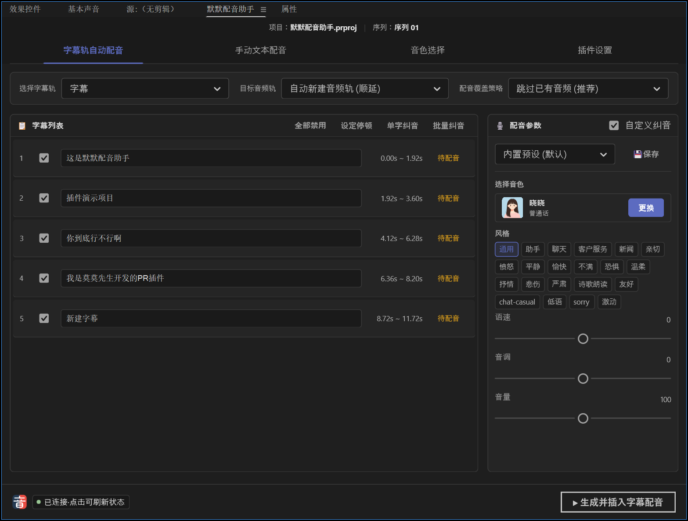

# 默默配音助手

一个面向 DaVinci Resolve 和 Premiere Pro 的自动配音插件，基于 Azure Speech Service 把字幕或手动输入的文字转换为配音，并直接插入到时间线。





## 功能

- **字幕轨自动配音**：读取当前时间线的字幕轨，按每条字幕的起始帧批量生成配音并插入目标音频轨。
- **手动文本配音**：手动输入一段文字，生成配音后插入到当前播放头位置。
- **多音字纠音**：内置多音字词典自动匹配，支持单字纠音、批量纠音，可自定义词条。
- **停顿控制**：可在文本中插入 50ms ~ 2s 的停顿标记，控制配音节奏。
- **参数预设**：可保存音色、风格、语速、音调、音量等参数为预设，一键切换。
- **缓存复用**：相同文字+音色+参数的配音会复用本地缓存，减少重复调用 Azure。
- **SRT 导入**：支持在无字幕轨时手动导入本地 SRT 文件作为字幕源。

## 支持的宿主

| 版本 | 宿主 | 最低版本 | 技术栈 |
|------|------|---------|--------|
| DaVinci Resolve 版 | DaVinci Resolve Studio | 内置 Node.js ≥ 14 | Electron + Workflow Integration API |
| Premiere Pro 版 | Adobe Premiere Pro | 25.6.0（低版本未做测试） | UXP + Spectrum Web Components |

两个版本共享同一套 Azure TTS 后端和功能逻辑，界面分别针对各自宿主做了适配。

## 安装

### 方式一：使用安装器（推荐）

1. 获取安装器 `momovoicesub-setup-v版本号.exe`。
2. 双击运行，安装器会自动检测本机是否安装了 DaVinci Resolve 和 Premiere Pro。
3. 勾选需要安装的组件（DR 版 / PR 版 / 全部）。
4. 点击"安装"，完成后打开对应软件即可使用。

安装器特点：

- 自动检测 DR 和 PR 的安装位置，无需手动选路径。
- PR 版**不依赖 Adobe Creative Cloud**，直接写入 UXP 插件注册信息，支持未安装 CC Desktop 的环境。
- DR 版会自动复制你当前安装的达芬奇版本的 `WorkflowIntegration.node` 依赖文件。
- 支持从"控制面板 > 程序和功能"卸载，卸载时自动清理插件文件和注册信息。

### 方式二：开发模式安装

分别使用各自的脚本：

```powershell
# DaVinci Resolve 版
powershell -ExecutionPolicy Bypass -File .\scripts\dr-install.ps1

# Premiere Pro 版（开发构建用）
powershell -ExecutionPolicy Bypass -File .\scripts\pr-install.ps1
```

PR 版开发模式还需要：

1. 安装 [UXP Developer Tool](https://developer.adobe.com/photoshop/uxp/2022/guides/devtool/)（UDT）。
2. 在 Premiere Pro 中：`编辑 > 首选项 > 增效工具`，勾选"启用开发人员模式"。
3. 重启 Premiere Pro。

## 打开插件

安装完成后，在对应软件中打开插件面板：

| 版本 | 打开方式 |
|------|---------|
| DaVinci Resolve | `工作区 > 流程整合 > 默默配音助手` |
| Premiere Pro | `窗口 > UXP 增效工具 > 默默配音助手` |

## 使用前配置

首次使用需要在插件"设置"页配置 Azure Speech 服务：

1. 在 [Azure Portal](https://portal.azure.com/) 创建 Speech 资源，获取 Key 和区域。
2. 在插件设置页填写：
   - **Azure Speech Key**：资源密钥
   - **服务区域**：如 `eastasia`
   - **自定义端点**（可选）：留空使用默认，或填写反代地址
3. 勾选"记住密钥"可加密保存到本机（DR 版使用 Electron safeStorage，PR 版使用 UXP key-value-storage）。
4. 点击"测试连接"，成功后点击"刷新音色"获取可用音色列表。
5. 点击"保存设置"。

## 使用流程

### 字幕自动配音

1. 在时间线上准备好字幕轨。
2. 在插件中选择字幕轨、目标音频轨和覆盖策略（跳过已有 / 覆盖）。
3. 选择音色、风格、语速等参数。
4. 点击"生成字幕配音"，等待批量处理完成。

### 手动配音

1. 切换到"手动配音"页。
2. 在文本框输入文字，可用"单字纠音"标注多音字读音，用"设定停顿"插入停顿。
3. 选择目标音频轨和音色参数。
4. 点击"生成并插入到播放头"。

## 缓存管理

两个版本的缓存路径不同：

**DaVinci Resolve 版**：

```text
%APPDATA%\momovoicesub\cache
```

**Premiere Pro 版**（UXP 沙箱限制，路径固定，按项目名分子目录）：

```text
%APPDATA%\Adobe\UXP\PluginsStorage\PPRO\<PR版本>\External\com.momo.voicesub.pr\PluginData\cache
```

在设置页可执行：

- 打开缓存目录
- 删除未使用缓存（仅清理当前项目时间线未引用的）
- 删除当前项目缓存
- 删除全部缓存

## 项目结构

```text
apps/
  com.momo.voicesub.dr/      # DaVinci Resolve 版插件源码
  com.momo.voicesub.pr/      # Premiere Pro UXP 版插件源码
installer/
  momovoicesub.iss           # Inno Setup 安装器脚本
  build.ps1                  # 一键构建安装器
  src/                       # 安装器依赖（中文语言包、图标、PR JSON 管理脚本）
scripts/
  dr-install.ps1             # DR 版开发安装脚本
  pr-install.ps1             # PR 版开发安装脚本
docs/                        # 截图和图标资源
VERSION                      # 版本号（DR 和 PR 共用）
```

## 构建安装器

从源码构建安装器 exe：

```powershell
# 需要 Node.js 和 Inno Setup 6
powershell -ExecutionPolicy Bypass -File .\installer\build.ps1
```

构建产物输出到 `_output\momovoicesub-setup-<version>.exe`。

## 许可证

本项目源代码基于 [GPL-3.0](LICENSE) 协议开源。

`WorkflowIntegration.node`（Blackmagic Design 提供）和 Azure Speech Service 不受此协议约束。
