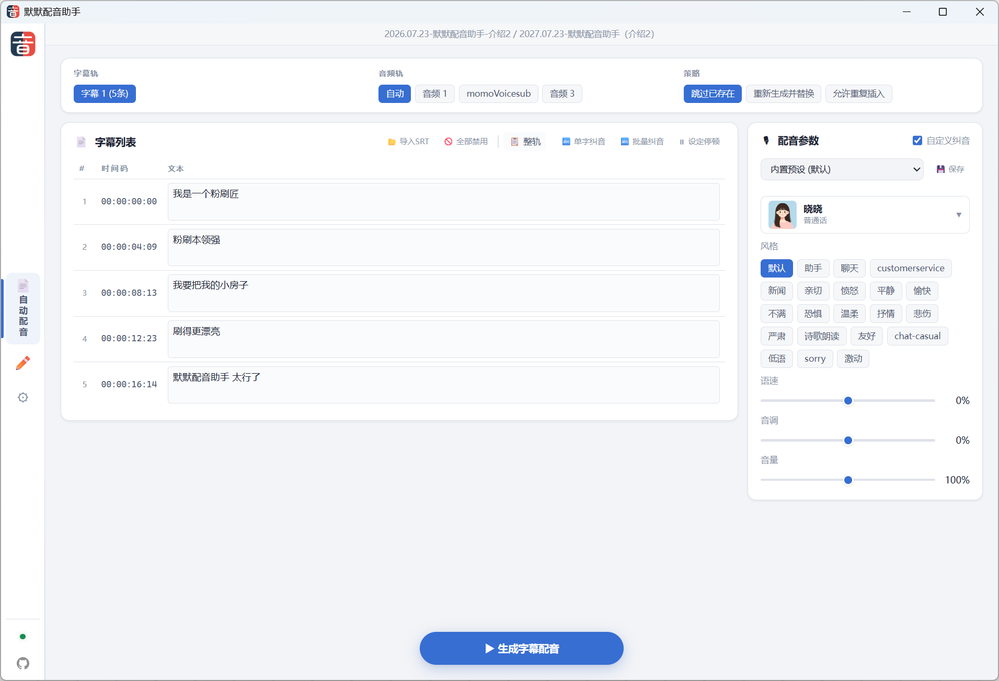

# 默默配音助手

一个面向 DaVinci Resolve 和 Premiere Pro 的自动配音插件，基于 Azure Speech Service 把字幕或手动输入的文字转换为配音，并直接插入到时间线。




## 功能

- **字幕轨自动配音**：读取当前时间线的字幕轨，按每条字幕的起始帧批量生成配音并插入目标音频轨。
- **手动文本配音**：手动输入一段文字，生成配音后插入到当前播放头位置。
- **多音字纠音**：内置多音字词典自动匹配，支持单字纠音、批量纠音，可自定义词条。
- **停顿控制**：可在文本中插入 50ms ~ 2s 的停顿标记，控制配音节奏。
- **参数预设**：可保存音色、风格、语速、音调、音量等参数为预设，一键切换。
- **缓存复用**：相同文字+音色+参数的配音会复用本地缓存，减少重复调用 Azure。
- **SRT 导入**：支持在无字幕轨时手动导入本地 SRT 文件作为字幕源。

## 支持的宿主

| 版本 | 宿主 | 最低版本 | 技术栈 |
|------|------|---------|--------|
| DaVinci Resolve 版 | DaVinci Resolve Studio | 内置 Node.js ≥ 14 | Electron + Workflow Integration API |
| Premiere Pro 版 | Adobe Premiere Pro | 25.6.0（低版本未做测试） | UXP + Spectrum Web Components |

两个版本共享同一套 Azure TTS 后端和功能逻辑，界面分别针对各自宿主做了适配。

## 安装

### 方式一：使用安装器（推荐）

1. 获取安装器 `momovoicesub-setup-v版本号.exe`。
2. 双击运行，安装器会自动检测本机是否安装了 DaVinci Resolve 和 Premiere Pro。
3. 勾选需要安装的组件（DR 版 / PR 版 / 全部）。
4. 点击"安装"，完成后打开对应软件即可使用。

安装器特点：

- 自动检测 DR 和 PR 的安装位置，无需手动选路径。
- PR 版**不依赖 Adobe Creative Cloud**，直接写入 UXP 插件注册信息，支持未安装 CC Desktop 的环境。
- DR 版会自动复制你当前安装的达芬奇版本的 `WorkflowIntegration.node` 依赖文件。
- 支持从"控制面板 > 程序和功能"卸载，卸载时自动清理插件文件和注册信息。

### 方式二：开发模式安装

分别使用各自的脚本：

```powershell
# DaVinci Resolve 版
powershell -ExecutionPolicy Bypass -File .\scripts\dr-install.ps1

# Premiere Pro 版（开发构建用）
powershell -ExecutionPolicy Bypass -File .\scripts\pr-install.ps1
```

PR 版开发模式还需要：

1. 安装 [UXP Developer Tool](https://developer.adobe.com/photoshop/uxp/2022/guides/devtool/)（UDT）。
2. 在 Premiere Pro 中：`编辑 > 首选项 > 增效工具`，勾选"启用开发人员模式"。
3. 重启 Premiere Pro。

## 打开插件

安装完成后，在对应软件中打开插件面板：

| 版本 | 打开方式 |
|------|---------|
| DaVinci Resolve | `工作区 > 流程整合 > 默默配音助手` |
| Premiere Pro | `窗口 > UXP 增效工具 > 默默配音助手` |

## 使用前配置

首次使用需要在插件"设置"页配置 Azure Speech 服务：

1. 在 [Azure Portal](https://portal.azure.com/) 创建 Speech 资源，获取 Key 和区域。
2. 在插件设置页填写：
   - **密钥**：资源密钥
   - **位置/区域**：如 `eastasia`
3. 勾选"记住密钥"可加密保存到本机（DR 版使用 Electron safeStorage，PR 版使用 UXP key-value-storage）。
4. 点击"测试连接"，成功后点击"刷新音色"获取可用音色列表。
5. 点击"保存设置"。

> **进阶：自建反代 / 代理网关**
> 如需通过自建代理访问 Azure TTS（如国内加速），可在插件数据目录的 `settings.json` 中手动设置 `"endpoint": "https://你的代理地址"`。留空则由"位置/区域"自动推导 Azure 官方端点，日常使用无需配置此项。

## 使用流程

### 字幕自动配音

1. 在时间线上准备好字幕轨。
2. 在插件中选择字幕轨、目标音频轨和覆盖策略（跳过已有 / 覆盖）。
3. 选择音色、风格、语速等参数。
4. 点击"生成字幕配音"，等待批量处理完成。

### 手动配音

1. 切换到"手动配音"页。
2. 在文本框输入文字，可用"单字纠音"标注多音字读音，用"设定停顿"插入停顿。
3. 选择目标音频轨和音色参数。
4. 点击"生成并插入到播放头"。

## 缓存管理

两个版本的缓存路径不同：

**DaVinci Resolve 版**：

```text
%APPDATA%\momovoicesub\cache
```

**Premiere Pro 版**（UXP 沙箱限制，路径固定，按项目名分子目录）：

```text
%APPDATA%\Adobe\UXP\PluginsStorage\PPRO\<PR版本>\External\com.momo.voicesub.pr\PluginData\cache
```

在设置页可执行：

- 打开缓存目录
- 删除未使用缓存（仅清理当前项目时间线未引用的）
- 删除当前项目缓存
- 删除全部缓存

## 项目结构

```text
apps/
  com.momo.voicesub.dr/      # DaVinci Resolve 版插件源码
  com.momo.voicesub.pr/      # Premiere Pro UXP 版插件源码
installer/
  momovoicesub.iss           # Inno Setup 安装器脚本
  build.ps1                  # 一键构建安装器
  src/                       # 安装器依赖（中文语言包、图标、PR JSON 管理脚本）
scripts/
  dr-install.ps1             # DR 版开发安装脚本
  pr-install.ps1             # PR 版开发安装脚本
docs/                        # 截图和图标资源
VERSION                      # 版本号（DR 和 PR 共用）
```

## 构建安装器

从源码构建安装器 exe：

```powershell
# 需要 Node.js 和 Inno Setup 6
powershell -ExecutionPolicy Bypass -File .\installer\build.ps1
```

构建产物输出到 `_output\momovoicesub-setup-<version>.exe`。

## 版本发布流程

项目以 `VERSION` 文件作为版本号唯一真相源，DR 和 PR 各自独立版本号。发布新版本时需按以下步骤同步版本号并验证构建：

### 1. 修改版本号

编辑 `VERSION` 文件：

```text
com.momo.voicesub.dr.version=26.8.2
com.momo.voicesub.pr.version=26.7.31
```

### 2. 同步版本号到插件（必须本地执行）

```powershell
# DR 版：同步 VERSION → package.json + manifest.xml
powershell -ExecutionPolicy Bypass -File .\scripts\dr-install.ps1

# PR 版：同步 VERSION → package.json + manifest.json，并构建 dist-dev/
powershell -ExecutionPolicy Bypass -File .\scripts\pr-install.ps1
```

> ⚠️ 这一步是必须的。GitHub Actions 不会帮你同步 `package.json` / `manifest`，如果这两个文件没同步，安装包里的插件版本就是旧的。

### 3. 本地验证打包（推荐）

```powershell
powershell -ExecutionPolicy Bypass -File .\installer\build.ps1
```

这一步会：

- 从 `VERSION` 读取版本号，**自动同步到 `dr-setup.iss` 和 `pr-setup.iss`** 的 `#define MyAppVersion` 行
- 构建 PR 插件 `dist/`
- 准备 `installer/payload/`（DR 和 PR 分别打包）
- 调用 Inno Setup 编译产出两个 exe 到 `_output/`

> 💡 `.iss` 文件里的版本号即使没手动同步，`build.ps1` 也会在构建时自动改写，GitHub Actions 同样会执行这个同步。但本地先跑一遍可以提前发现构建错误、验证 payload 完整性，并保持 git 仓库干净（同步后的 `.iss` 一并 commit）。

### 4. 提交并推送

```powershell
git add VERSION apps/ installer/dr-setup.iss installer/pr-setup.iss
git commit -m "release: v26.8.2 / v26.7.31"
git push
```

### 5. 打标签触发 GitHub Actions 自动发布

```powershell
git tag v26.8.2
git push origin v26.8.2
```

推送 `v*` 标签后，`.github/workflows/release.yml` 会自动在 `windows-latest` 上：

1. `npm ci` + `npm run build` 构建 PR 插件
2. `choco install innosetup` 安装 Inno Setup
3. `installer/build.ps1` 读取 `VERSION` → 准备 payload → 同步 `.iss` 版本号 → ISCC 编译
4. 产出 `momovoicesub-dr-setup-v*.exe` 和 `momovoicesub-pr-setup-v*.exe`
5. 自动创建 GitHub Release 并上传两个安装包

> 也可通过 Actions 页面 `workflow_dispatch` 手动触发，仅构建产出 artifact 供测试，不会发布 Release。

### 关于 .iss 文件

`dr-setup.iss` / `pr-setup.iss` 是 Inno Setup 的**源代码**，不是构建产物，必须纳入 git。`build.ps1` 只自动改写其中的版本号那一行，其余 200+ 行（`[Setup]` 配置、`[Files]` 打包规则、`[Code]` 段的达芬奇检测 / 卸载弹窗 UI 等）都是手工编写的编译指令，GitHub Actions 离了它无法打包。

## 本地开发与云端环境

DR 版插件根据 manifest Id 自动判断运行环境：

| 环境 | manifest Id | API 地址 | Web 地址 | 适用场景 |
|------|------------|---------|---------|---------|
| dev 版 | `com.momo.voicesub.dr.dev` | `http://localhost:3000` | `http://localhost:3001` | 本地开发调试 |
| 正式版 | `com.momo.voicesub.dr` | `https://momovoicesub.sxrec.com` | 同域名 | 生产环境 |

`dr-install.ps1` 安装 dev 版时会自动把 manifest Id 改为 `.dev` 后缀，源码保持正式版不变。插件启动时根据 Id 是否以 `.dev` 结尾切换 API/Web 地址，无需额外配置文件。

### 本地开发云端服务

DR dev 版插件需要连接本地运行的云端服务才能完整测试登录、配额、TTS 合成等功能：

```bash
# 在 momovoicesub-yun 仓库
pnpm dev:api    # 启动 API 服务 (http://localhost:3000)
pnpm dev:web    # 启动 Web 官网 (http://localhost:3001)
```

**推荐**：本地开发使用独立的 Supabase 项目，与生产环境完全隔离，避免测试数据污染真实用户库（测试账号、设备指纹、白名单改动等互不影响）。只需在本地 `packages/api/.env` 中配置开发专用的 `SUPABASE_URL` / `SUPABASE_SERVICE_ROLE_KEY` / `SUPABASE_ANON_KEY` 即可，首次启动 API 会自动建表 + 种子数据。

如果确实想临时连生产库排查问题，把生产环境的 Supabase 密钥填进本地 `.env` 也可以，但务必注意不要做破坏性操作。

## 许可证

本项目源代码基于 [GPL-3.0](LICENSE) 协议开源。

`WorkflowIntegration.node`（Blackmagic Design 提供）和 Azure Speech Service 不受此协议约束。
